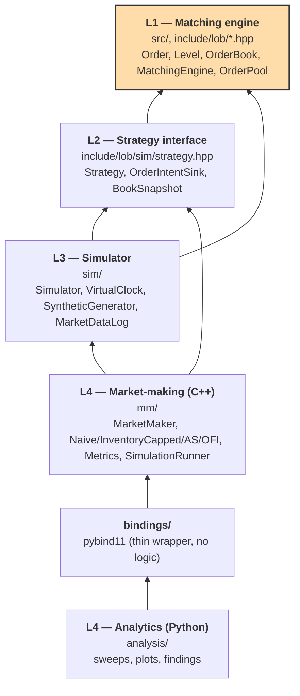

# Order Matching Engine

A low-latency limit order book (LOB) matching engine in C++, wrapped in an
event-driven simulator, used as a lab for inventory-aware market-making
strategies (Avellaneda-Stoikov, order-flow-imbalance).

**Status: M6, polish, all milestones complete.** M1/M2 cover all five
order types, price-time-priority matching, cancel, modify, and trade
events, with full test coverage. M3 added a pooled allocator, a
cache-friendly `Order` layout, a lock-free SPSC ring buffer, and a
benchmark harness (see Benchmarking). M4 built the L3 event-driven
simulator on top: data replay, a virtual clock, the queue-position fill
model, a latency model, and a strategy callback interface (see
Simulator). M5 added four market-making strategies (naive,
inventory-capped, Avellaneda-Stoikov, order-flow-imbalance), a metrics
suite, pybind11 bindings, and a Python analytics layer that produces the
plots and sweeps below (see Market-making study). M6 added the
architecture diagram, `./scripts/demo.sh`, an API cleanup pass, and
[`RESULTS.md`](RESULTS.md).

See [`RESULTS.md`](RESULTS.md) for a short standalone writeup of the key
engineering decisions and M5 findings, including three real
reconciliation bugs found by driving the strategies with continuous
synthetic flow.

## Quickstart

```bash
git clone <this repo> && cd order-matching-engine
./scripts/demo.sh
```

One command: configures a Release build, builds it, runs the full test
suite, smoke-checks the benchmark harness, and reproduces M5's headline
plots into `analysis/output/`. Well under 10 minutes on a clean checkout
— a full from-scratch run, including fetching and building googletest,
Google Benchmark, and pybind11, took about 35 seconds on the machine
this was verified on. If the last step fails with a `lob_bindings`
import error, see the multi-Python note under Market-making study; the
script prints the exact fix.

## Build

```bash
cmake -S . -B build -DCMAKE_BUILD_TYPE=RelWithDebInfo
cmake --build build -j
```

## Test

```bash
ctest --test-dir build --output-on-failure
```

## Sanitized build (ASan + UBSan)

```bash
cmake -S . -B build -DLOB_ENABLE_SANITIZERS=ON -DCMAKE_BUILD_TYPE=Debug
cmake --build build -j
ctest --test-dir build --output-on-failure
```

## Fuzzing

The matching engine has a libFuzzer harness (`tests/fuzz/fuzz_matching.cpp`)
that decodes a mutated byte buffer into a sequence of add/cancel/modify
operations and checks every invariant after each one. It needs real LLVM
clang — libFuzzer's runtime isn't shipped by AppleClang on macOS — so a
short smoke run is wired into `ctest` automatically whenever the compiler
qualifies. To fuzz for longer locally (e.g. via Homebrew's llvm on macOS):

```bash
cmake -S . -B build-fuzz \
  -DCMAKE_CXX_COMPILER=/opt/homebrew/opt/llvm/bin/clang++ \
  -DCMAKE_C_COMPILER=/opt/homebrew/opt/llvm/bin/clang
cmake --build build-fuzz -j
./build-fuzz/tests/lob_fuzz_matching -max_total_time=60
```

## Concurrency testing (ThreadSanitizer)

The SPSC ring buffer (`include/lob/spsc_ring_buffer.hpp`) is the
project's first genuine concurrent component, so it gets its own TSan
build. TSan can't coexist with ASan/UBSan in the same binary, so this is
a separate, minimal executable that doesn't even link the main `lob`
library — the ring buffer is header-only and needs nothing from it:

```bash
cmake -S . -B build-tsan -DLOB_BUILD_TSAN_TESTS=ON -DLOB_BUILD_BENCHMARKS=OFF -DLOB_BUILD_FUZZERS=OFF
cmake --build build-tsan --target lob_tsan_tests -j
ctest --test-dir build-tsan --output-on-failure -R SpscRingBufferTest
```

## Benchmarking

```bash
cmake -S . -B build -DCMAKE_BUILD_TYPE=Release
cmake --build build -j
./build/benchmarks/lob_bench
```

Build **without** `-DLOB_ENABLE_SANITIZERS=ON` (the default) for
meaningful numbers: `lob` links ASan/UBSan flags publicly when that
option is on, and the instrumentation overhead would otherwise skew
every measurement. CI still builds and runs the benchmark binary once
under sanitizers as a smoke check — crash-free, not for timing — see
`.github/workflows/ci.yml`.

**A note on the environment.** These numbers come from a shared dev
laptop (macOS, Apple Silicon) and GitHub-hosted CI runners, not an
isolated bare-metal lab. Thread pinning and frequency scaling aren't
reliably controllable on either — `lob_bench` prints a "failed to set
thread affinity" warning on this machine, which is itself evidence of
that. What the benchmark actually does: pre-populate a realistic book
depth, then sample 100,000 individual operation latencies via
`std::chrono::steady_clock`, reporting p50/p90/p99/p99.9/p99.99 alongside
Google Benchmark's own throughput counter.

### Matching engine (this machine, unsanitized Release build)

| Operation | Baseline p50 | +Pool p50 | +Cache layout p50 | Baseline throughput | Final throughput |
|---|---|---|---|---|---|
| Add (no cross) | 41ns | 41ns | 41ns | 15.3M/s | 16.5M/s |
| Add (single-level cross) | 41ns | 41ns | 41ns | 20.0M/s | 19.4M/s |
| Add (5-level cross) | 375ns | 292ns | 292ns | 977K/s | 1.04M/s |
| Cancel | 41ns | 41ns | 41ns | 17.6M/s | 20.4M/s |
| Modify | 83ns | 42ns | 42ns | 10.7M/s | 12.8M/s |

### Optimization → latency delta attribution

| Optimization | Operation | Before | After | Delta |
|---|---|---|---|---|
| M3 Step 1: Order-object memory pool | Modify (cancel+re-add path) | 83ns | 42ns | **-49%** |
| M3 Step 1: Order-object memory pool | Add (5-level cross) | 375ns | 292ns | **-22%** |
| M3 Step 1: Order-object memory pool | Add/Cancel (simple, no churn) | 41ns | 41ns | ~0% (already at this platform's clock-resolution floor) |
| M3 Step 2: cache-friendly `Order` layout (`alignas(64)`) | all ops | — | — | flat, as expected — single-threaded, so there's no concurrent access to have false-shared a cache line yet. Groundwork for M4's thread split, not a win measurable now. |

Scope note: "zero allocation after warm-up" (PROJECT_SPEC.md §6) applies
specifically to `Order`-object allocation. `order_index_` is still a
standard node-based `unordered_map`, which heap-allocates a node per
`emplace()` regardless of `reserve()` — a smaller, separately documented
residual cost this milestone doesn't eliminate (a custom allocator for
that would add real portability risk across libstdc++/libc++ for a
comparatively small win).

### SPSC ring buffer (new component, not a delta)

| Benchmark | Result |
|---|---|
| Single-threaded push+pop round trip | p50 41ns |
| Genuine two-thread throughput | 33-53M items/sec across repeated runs (~44M typical) |

The two-thread number is the least stable measurement in this table,
run to run, on this shared and unpinned machine (33M-53M/s across five
consecutive runs at M6) — reported as a range rather than a single point
estimate, per the environmental note above. The single-threaded and
matching-engine numbers were all re-confirmed at M6 and are unchanged
from M3 to within noise, as expected: no L1 hot-path code has changed
since (M4/M5 only added new, separate methods and consumers of the
existing `MatchingEngine`/`OrderBook` API).

### Array-vs-tree price levels (§5.2 — evaluated, not adopted)

Standalone comparison (not wired into `OrderBook`): identical random
insert/lookup/erase workload over a realistic ±500-tick near-touch window.

| Container | Mean | Throughput |
|---|---|---|
| `std::map<Price, Level>` (current, production) | 48.3ns | 20.7M/s |
| Flat array (`std::vector<std::optional<Level>>`) | 36.3ns | 27.5M/s |

**Decision: keep `std::map` in production.** The flat array's ~25-33%
win is real and reproducible, but a fixed-range array needs a policy for
prices that drift outside the pre-allocated window (real exchanges
typically re-center or fall back to a secondary structure) — added
complexity and re-verification surface, since all of M1/M2's invariant,
determinism, and fuzz coverage would need re-checking against a
container swap. Not justified yet: this is still a single-threaded
engine with no live feed, so there's no usage data showing the tree is
an actual bottleneck. Worth revisiting if M4/M5 profiling ever changes
that.

## Architecture

Four layers, each independently testable. Arrows point from a layer to
what it depends on — L1 has zero dependency on anything above it, the
one boundary this project won't relax:



The engine doesn't know what a "strategy" is; a strategy doesn't know
how the engine stores orders. `MarketMaker` subclasses implement
`Strategy` (L2) and are driven by `Simulator` (L3), which owns the one
shared `MatchingEngine` (L1) that both replayed and strategy-issued
orders match against. `bindings/` and `analysis/` are strictly one-way —
Python never reaches below the single `RunSimulation` entry point.

The benchmark table above was re-verified at M6 (see the SPSC ring
buffer section) and was otherwise unchanged from M3 to within noise;
result plots from the M5 market-making study are reproduced by
`./scripts/demo.sh`, with findings summarized further down.

## Simulator (M4)

`sim/` is the L3 event-driven simulator. A single discrete-event loop
(`Simulator`, `include/lob/sim/simulator.hpp`) drains a min-heap of
`Event`s in strict `(timestamp, kind, sequence)` order, driving one
shared `MatchingEngine`. Time is virtual, never wall-clock —
`VirtualClock` tracks the last processed timestamp and throws if it
ever moves backward.

**Data source: synthetic for M4.** True L3 per-order data isn't freely
available for crypto exchanges, and LOBSTER (real equities L3 data)
requires registering on their site — neither is fetchable in an
automated way. `SyntheticGenerator` (`include/lob/sim/
synthetic_generator.hpp`) produces a seeded, deterministic Poisson-
arrival order-flow stream instead, which satisfies M4's actual bar:
replay a sample day, reconstruct the book correctly, fire strategy hooks
deterministically.

### Real-data (LOBSTER) validation

Tried this as a follow-up, and it surfaced something worth documenting
rather than working around.

`analysis/lobster_loader.py` parses LOBSTER's public message/orderbook
CSV format and converts Submission, Deletion, Partial-cancellation, and
Execution events onto `ReplayMessage`'s Add/Cancel/Reduce model. Partial
cancellation goes through `OrderBook::ReduceQuantity`, which preserves
FIFO priority (unlike `modify_order`'s cancel-and-re-add). Execution
groups consecutive same-timestamp rows into one synthesized aggressor
`Add` rather than applying the recorded fill directly, for the same
reason described above — never bypass matching once a strategy order
could be interposed. `sim/lobster_replay.cpp` plus a pybind11 binding
(`replay_lobster_events`) then drives a real `MatchingEngine` through
the converted events, and `analysis/lobster_validate.py` diffs the
result against LOBSTER's own published orderbook file, row by row.

Run against a real sample day — AAPL, 2012-06-21, Level 5, a free
LOBSTER sample not committed to this repo (see `.gitignore`'s
`data/lobster/` entry) — the exact full-depth match rate is 0.027% (76
of 282,490 comparable rows). That's not a matching-engine bug. It's a
hard limit of what a finite-depth LOBSTER export can support, and
tracing specific orders through the raw file shows why:

1. **LOBSTER's book isn't empty at file-start.** Row 0 of the real
   orderbook file already shows a fully populated 5-level book on both
   sides, even though the message file's first row is a single
   new-order submission. The rest is opening-auction and pre-market
   liquidity with no `Submission` record anywhere in the file — a
   from-scratch reconstruction has no way to know it exists, so almost
   every row's deeper levels differ by construction, not by error.
2. **Levels that leave the top-N window can change size with no
   message-file evidence.** Order `16167159` (18 shares at 585.36,
   submitted once at row 12 and never referenced again in the
   371K-row file) shows correctly as 18 resting at row 12. By row 103,
   after temporarily falling out of the top-5 window at row 22 and
   re-entering later, LOBSTER's real book shows only 5 at that same
   price. Nothing in the message file explains the drop — it happened
   while the price was outside the requested depth, which a Level-5
   export simply doesn't report. Level N only promises fidelity for the
   top N levels at the moment each row is emitted, not a complete
   history of every price a reconstruction might later need.

Restricting the comparison to price levels where both sides show the
same price gives a second, more targeted number: quantity soundness of
73.2% (of 1,123,910 such comparable levels, our known resting quantity
exceeded LOBSTER's reported quantity 26.8% of the time), entirely
attributable to mechanism 2 above on a fast-moving name like AAPL — not
overcounting in the matching engine itself, which M1/M2's invariant
tests and fuzzing already cover independently.

The pipeline runs end-to-end on real data without error: 93.7% of the
day's 301,587 rows convert to a well-defined replay event, and the rest
are either hidden-order executions (zero visible-book impact by
definition) or references to pre-existing orders the file was never
going to describe — both tracked and counted via `to_replay_events`'s
`stats` output. What this experiment actually shows is that byte-exact
absolute book-state validation isn't achievable from a single
finite-depth LOBSTER file, for any reconstruction engine, correct or
not. Reproduce with `python3 analysis/lobster_validate.py` after
obtaining a sample file.

### The queue-position fill model is (almost) free

PROJECT_SPEC.md §7 requires that "a resting maker order sits behind the
volume already at its price and only fills once the queue ahead of it is
consumed." `OrderBook` already implements strict FIFO-per-level
price-time priority (M1-M3) and doesn't distinguish whose order is
resting, so injecting a strategy's order into the same `OrderBook`
instance processing replayed flow, at the correct chronological
position, gives correct queue-position realism for free — no separate
queue-depth structure needed. This holds specifically for
**L3-granularity input** (true per-order arrival sequence), which is
what the synthetic generator produces. `tests/sim/queue_position_test.cpp`
proves it end-to-end: a strategy order injected behind existing resting
volume doesn't fill until a later taker exactly exhausts everything
ahead of it.

### Design decisions worth knowing

- **No `Execute` replay message type.** Applying a recorded historical
  execution directly — marking a specific resting order filled by fiat
  — is wrong once a strategy order can be interposed between historical
  makers: it would silently ignore the strategy order and violate
  price-time priority. `ReplayMessage` is `{Add, Cancel, Reduce}`; the
  synthetic generator emits marketable orders as ordinary `Add`s and
  needs no reconstruction. For real L3 data (see the LOBSTER section
  above), the right approach is to synthesize an implicit aggressor
  `Add` from grouped `Execute` records and let the engine re-derive the
  match against whatever's actually resting, never bypass matching.
- **Disjoint id namespace.** Historical/generator ids start at 1;
  strategy-issued ids start at `kStrategyIdBase = 1 << 63`
  (`include/lob/sim/id_space.hpp`), assigned internally by `Simulator`
  so a `Strategy` never handles raw ids. Without this split, a
  collision would silently hit `OrderBook::add_order`'s duplicate-id
  rejection and drop a strategy order with no error signal.
- **Strict event tie-break.** Equal-timestamp events never fall back to
  `std::priority_queue`'s unspecified tie behavior: `Replay` events sort
  before `StrategyOrderArrival` events at the same tick (no look-ahead
  bias — a strategy action must never jump ahead of a historical event
  it couldn't have observed yet), then by a monotonic push-order
  `sequence`.
- **`Strategy` never touches `MatchingEngine` directly** — only the
  narrow `OrderIntentSink` (`Submit`/`Cancel`/`Modify`), which schedules
  a delayed event rather than applying anything synchronously. This is
  what actually enforces the latency model; a direct engine reference
  would let a future strategy bypass it.
- **Uniform callback-firing rule.** After every engine-state-changing
  call, replay or strategy-issued: `OnTrade` once per `TradeEvent` in
  fill order, then exactly one `OnBookUpdate` with the final state.
- **No self-trade prevention.** The engine has no owner concept — L1
  doesn't know about strategies — so this doesn't add server-side STP.
  A strategy that would cross its own resting order is responsible for
  avoiding that itself, matching how many real venues behave without
  STP by default.

### Testing

- `tests/sim/event_ordering_test.cpp` — event tie-break ordering,
  virtual clock monotonicity.
- `tests/sim/synthetic_generator_test.cpp` — same-seed determinism,
  id/timestamp invariants.
- `tests/sim/golden_replay_test.cpp` — a **hand-constructed** trace (not
  generated-and-snapshotted, which would only prove self-consistency)
  with **independently hand-computed** expected checkpoints, covering a
  same-level multi-order partial-fill sweep and a genuine mid-queue
  cancel.
- `tests/sim/queue_position_test.cpp` — the core insight, tested
  end-to-end.
- `tests/sim/simulator_determinism_test.cpp` — two independent runs with
  identical seeded input (including a strategy that itself submits
  orders, exercising strategy-event/replay-event interleaving, not just
  pure replay) produce byte-identical callback sequences and final book
  state.

## Market-making study (M5)

`mm/` is the L4 market-making layer: four strategies built on a shared
`MarketMaker` base class (`include/lob/mm/market_maker.hpp`), a metrics
suite, and a pybind11 entry point (`mm/simulation_runner.cpp`) that
Python drives for sweeps and plots (`analysis/`).

**Strategies, in order (each stacks on the previous one's mechanics):**
1. **Naive** — fixed half-spread around mid, ignores inventory
   entirely. The null baseline: expected to accumulate inventory and,
   over enough one-sided flow, lose.
2. **Inventory-capped** — same, but stops quoting a side once inventory
   hits a configured cap in that direction.
3. **Avellaneda-Stoikov** — reservation price skews away from inventory
   (`r = mid - inventory*gamma*sigma^2*tau`); half-spread widens with
   remaining time-to-horizon and narrows with book liquidity kappa.
4. **OFI** — adds an order-flow-imbalance skew on top of AS's
   reservation price, using top-of-book buy/sell pressure with the
   strategy's own resting quantity excluded (a strategy quoting the
   best level would otherwise bias the very signal it's reacting to).

**Metrics** (`include/lob/mm/metrics.hpp`): per-fill effective spread,
markout, and *pure adverse-selection cost* (drift-only, isolating what
OFI is actually supposed to improve — see the header's doc comment for
why markout alone conflates execution-price quality with post-trade
drift); PnL decomposed into spread PnL vs. inventory PnL; Sharpe
(unannualized, over the full mark-to-market series); fill rate; and
signed inventory extremes.

### Reconciliation correctness: three real bugs, found by driving it with real flow

Every strategy's quotes go through a shared reconciliation loop
(`MarketMaker::OnBookUpdate`/`TryRequoteSide`) that submits, modifies,
and cancels toward whatever `ComputeQuotes` wants. This looked solid
against a couple of static seed orders (the Step 1 unit tests), but
wiring the same base class up to the synthetic generator's continuous,
realistic order flow (the Step 5 pybind11 runner) surfaced three genuine
hangs that a thin, static book never exercised:

1. **A cross-side race.** With each side acking independently, bid and
   ask could settle asynchronously: one side's Modify, computed from a
   snapshot where the other side's already-issued but not-yet-applied
   Modify hadn't landed, could cross the other side's own still-resting
   order once it finally did. PostOnly rejects that by cancelling the
   original and rejecting the replacement, and chasing the rejection
   cycled forever instead of converging. Fixed by allowing only one
   Submit/Modify in flight across both sides at a time.
2. **A self-referential mid.** When a strategy's own order is the
   entire quantity resting at the best price, mid computed from that
   price is circular — with zero inventory skew, `bid = mid - hs` and
   `ask = mid + hs` hold for any mid, so there's no restoring force, and
   integer rounding adds a small systematic drift each settling round.
   Fixed with a `ReferenceMid` that only reports mid when at least one
   side is verifiably not entirely the strategy's own order, holding
   the last verified value steady otherwise.
3. **Market-crossing and limit-cycle hangs under continuous flow.**
   AS/OFI's inventory skew scales with `gamma*sigma^2*tau`, large for a
   long remaining horizon, and can swing far enough after one or two
   fills that the resulting quote crosses the real market; without a
   clamp, a rejected Submit/Modify just gets recomputed identically
   forever. Separately, OFI's self-excluded quantity is discontinuous
   exactly at the boundary of sharing a price level with real
   liquidity, producing a limit cycle (observed at both 2-tick and
   3-tick periods, and — once latency is nonzero, since each reaction's
   own ack lands at a later timestamp rather than the same one —
   recurring forever at increasing timestamps well past the session's
   configured duration). Fixed by clamping quotes against the raw
   external market, plus a cumulative (not per-tick) circuit breaker
   that holds a side's price once too many consecutive Modifies happen
   without genuine convergence in between.

All three reproduced directly in C++ — a killed, 100%-CPU process —
then got fixed and re-verified with stress sweeps of 200-800 (strategy
kind, seed, gamma, latency) combinations completing without hanging, on
top of the full test suite staying green under ASan+UBSan. See
`include/lob/mm/market_maker.hpp`'s class comment for the full
derivation of each.

### Python bindings and analytics

```bash
cmake --build build --target lob_bindings -j
pip install -r analysis/requirements.txt   # numpy, pandas, matplotlib
python3 analysis/generate_plots.py
```

`bindings/bindings.cpp` is a thin pybind11 wrapper (no logic of its own)
around `RunSimulation(SimulationConfig) -> SimulationResult`
(`include/lob/mm/simulation_runner.hpp`) — the one entry point Python
uses; every strategy stays C++-only. `analysis/lob_sweep.py` handles
path setup and DataFrame conversion; `analysis/generate_plots.py`
produces the four required plots plus a gamma sweep into
`analysis/output/` (gitignored — findings are written up here, not
committed as binary images).

**If you have more than one Python installed**, CMake's
`find_package(Python3)` may resolve a different interpreter than your
shell's default `python3` — the compiled module is tied to a specific
Python's ABI, so a mismatch shows up as `ModuleNotFoundError: No module
named 'lob_bindings'` even though the file exists. Check `grep
Python3_EXECUTABLE build/CMakeCache.txt` against `which python3`, and if
they differ, reconfigure with `-DPython3_EXECUTABLE=$(which python3)`.

**Calibrating gamma to session length.** AS/OFI's horizon is the full
session duration (`config.generator.duration`), so `variance_term =
gamma*sigma^2*tau` is huge near the start of a long session unless gamma
is scaled down accordingly — `gamma=0.1` (a fine default for a short
session) produces almost no fills at `duration=50000` (spreads too wide
to ever get hit); `gamma=0.001` was found empirically to produce a fill
count comparable to the other three strategies at that duration.
`analysis/generate_plots.py`'s `COMMON` dict and gamma-sweep range are
calibrated for `duration=50000`; rescale gamma roughly in proportion to
`1/duration` for a different session length.

### Findings (duration=50000, 30 seeds per point, arrival_rate=0.05, latency=5 unless swept)

Every table below is a mean over 30 independent seeds (seeds 1-30, only
the generator seed varies), reported as mean ± 95% CI (normal
approximation on the 30 per-seed values). This replaces an earlier
single-seed pass, and a couple of the conclusions changed once the
variance was visible, not just the numbers — see the notes under each
table.

**PnL decomposition** (spread PnL vs. inventory PnL):

| Strategy | Spread PnL | Inventory PnL | Total PnL | Fills |
|---|---:|---:|---:|---:|
| Naive | 2171.7 ± 364.8 | -3016.3 ± 2202.1 | -844.7 ± 1979.2 | 67.5 |
| Inventory-capped | 1766.8 ± 167.9 | -1623.7 ± 473.7 | 143.1 ± 491.0 | 55.5 |
| Avellaneda-Stoikov (gamma=0.001) | 385.5 ± 86.5 | -1482.3 ± 730.2 | -1096.8 ± 661.6 | 59.3 |
| OFI (gamma=0.001) | 358.7 ± 74.5 | -1406.8 ± 928.7 | -1048.1 ± 878.6 | 51.8 |

The single-seed version of this table reported naive as the best-PnL
strategy (742.0, positive) — that was a favorable seed, not a
representative one. Averaged over 30 seeds, naive's mean total PnL is
negative with a CI wider than its own mean: its outcome swings from
large gains to large losses depending on the flow it happens to see (see
inventory boundedness below for why). Inventory-capped is the only
strategy with a positive mean here, though its CI still straddles zero.
AS and OFI are consistently negative on average, and OFI vs. AS total
PnL aren't distinguishable from each other at this seed count (the CIs
overlap heavily). None of this is an apples-to-apples "which strategy is
better" ranking at matched risk — just each strategy run at one
representative configuration, with the sampling noise now visible
instead of hidden behind a single lucky or unlucky run.

**Inventory boundedness** (30-seed mean of each seed's max &#124;inventory&#124;; worst-case column is the single largest value seen across all 30 seeds):

| Strategy | Mean max &#124;inventory&#124; | Worst seed |
|---|---:|---:|
| Naive | 150.3 ± 67.4 | 992 |
| Inventory-capped | 53.6 ± 1.8 | 59 |
| Avellaneda-Stoikov | 10.7 ± 0.7 | 20 |
| OFI | 11.2 ± 1.0 | 20 |

This confirms §8's claim more strongly than the single-seed version did:
inventory-capped, AS, and OFI all bound tightly and consistently (narrow
CIs, worst case close to the mean). Naive doesn't just drift to "roughly
its full extent" as a stable behavior — its worst observed seed (992) is
nearly 7x its own mean and over 16x inventory-capped's cap. It carries
real, unbounded tail risk that a single seed can easily miss entirely.
Inventory-capped's cap of 50 is exceeded slightly on average since a
single fill can push it past the threshold checked before that fill.

**Adverse-selection markout** (mean per fill, AS vs. OFI):

| Strategy | Fills | Mean markout | Mean pure adverse-selection cost |
|---|---:|---:|---:|
| Avellaneda-Stoikov | 59.3 | -2.018 ± 0.608 | 2.938 ± 0.650 |
| OFI | 51.8 | -2.277 ± 0.956 | 3.286 ± 1.025 |

OFI − AS pure adverse-selection cost: +0.347, 95% CI half-width 1.213 —
not distinguishable from zero at 30 seeds. The single-seed version of
this table already flagged OFI as marginally worse than AS and warned
that sampling noise was likely large relative to the effect size; 30
seeds confirms that warning rather than resolving it either way. OFI's
excluded-self-quantity imbalance signal may still be doing something
real, but this experiment — this book, this synthetic flow, this seed
count — can't distinguish it from noise. A materially larger seed count
or a longer session would be needed before treating OFI's
adverse-selection edge as a real, present effect.

**PnL vs. injected latency** (OFI, gamma=0.001):

| Latency | Total PnL | Fills |
|---:|---:|---:|
| 0 | -987.6 ± 537.4 | 42.1 |
| 5 | -1048.1 ± 878.6 | 51.8 |
| 10 | -862.3 ± 610.1 | 49.4 |
| 20 | -525.3 ± 150.0 | 48.0 |
| 50 | -278.6 ± 75.2 | 36.3 |
| 100 | -124.2 ± 48.6 | 23.2 |
| 200 | -15.8 ± 34.2 | 12.0 |
| 500 | 5.6 ± 33.3 | 7.3 |

With 30 seeds per point, a real trend is visible that the single-seed
sweep couldn't show cleanly: mean PnL rises monotonically toward zero as
latency grows, and the CI narrows in step. Both come from the same
mechanism — fewer fills (51.8 → 7.3) means less exposure to adverse
selection per session, and fewer fills also means less variance in the
outcome. At latency=500 the CI still straddles zero, so "high latency
turns a profit" isn't supported — only "high latency reliably loses
less," down to a point statistically indistinguishable from breakeven.

**Gamma sweep** (Avellaneda-Stoikov, duration=50000):

| Gamma | Total PnL | Max &#124;inventory&#124; | Fills |
|---:|---:|---:|---:|
| 0.0001 | -3552.2 ± 272.1 | 18.2 ± 2.9 | 269.4 |
| 0.0005 | -2549.3 ± 669.1 | 12.3 ± 1.2 | 131.2 |
| 0.001 | -1096.8 ± 661.6 | 10.7 ± 0.7 | 59.3 |
| 0.005 | -1315.0 ± 2206.6 | 8.3 ± 1.2 | 11.5 |
| 0.01 | -2384.7 ± 4394.5 | 7.3 ± 1.4 | 7.9 |
| 0.05 | -14.9 ± 43.4 | 4.1 ± 1.5 | 1.1 |

Max |inventory| now shows the clean monotonic-with-gamma trend §8
predicts, with tight CIs throughout — the single-seed version's
non-monotonic reading there was noise, not a real effect. Total PnL is
messier than the single-seed table suggested: at gamma=0.005 and 0.01
the CI is several times wider than the mean itself (a handful of seeds
hit large losses, most don't), so "PnL gets worse before it gets better"
in the middle of this range isn't a reliable trend at this seed count.
Only the two ends are solid: very low gamma reliably loses a lot (tight
CI, trading constantly into adverse selection it can't out-earn on
spread), and gamma=0.05 is the only point close to breakeven and tightly
bounded, since it trades rarely enough that variance stays low.

All numbers above are reproducible from `analysis/generate_plots.py`
(`NUM_SEEDS = 30`, seeds 1-30) — rerun it directly to reproduce these
tables, or raise `NUM_SEEDS` for tighter CIs at the cost of runtime (30
seeds across all five sweeps takes well under a second on a normal
laptop, so raising it further is cheap).
