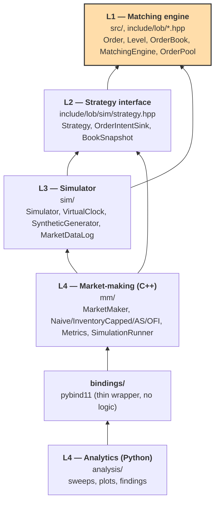
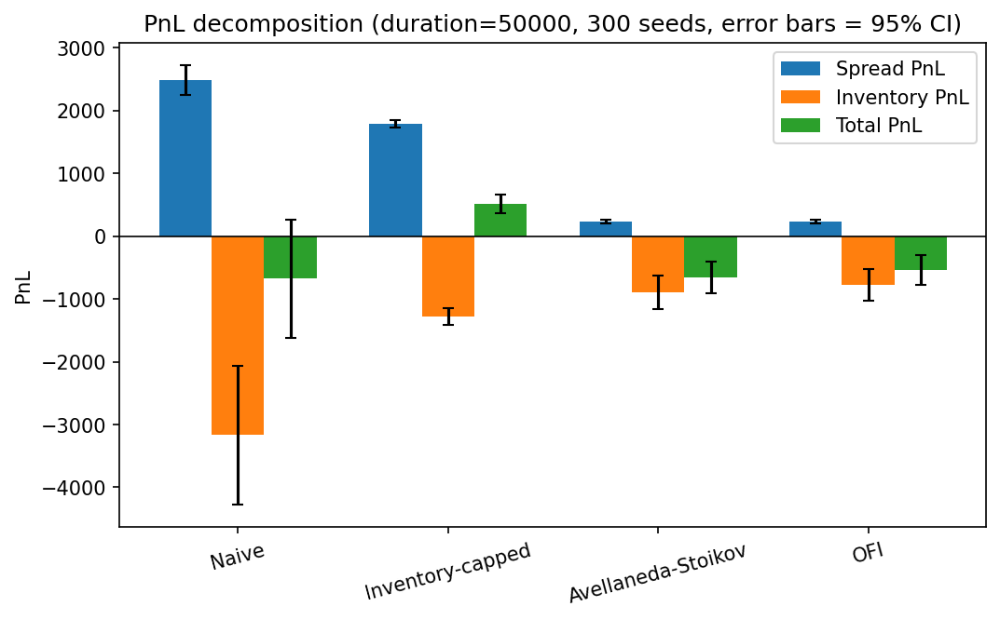
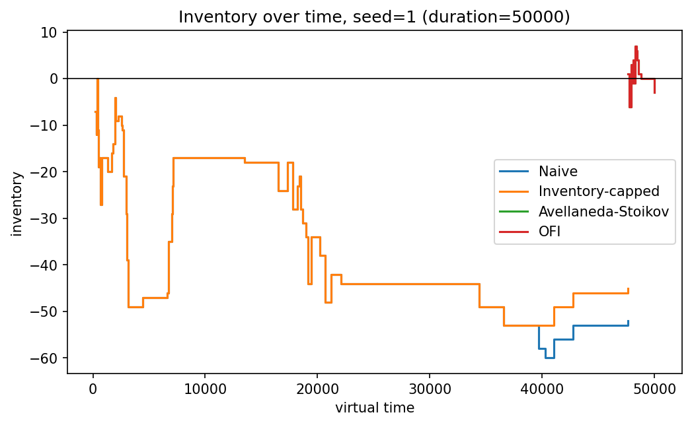
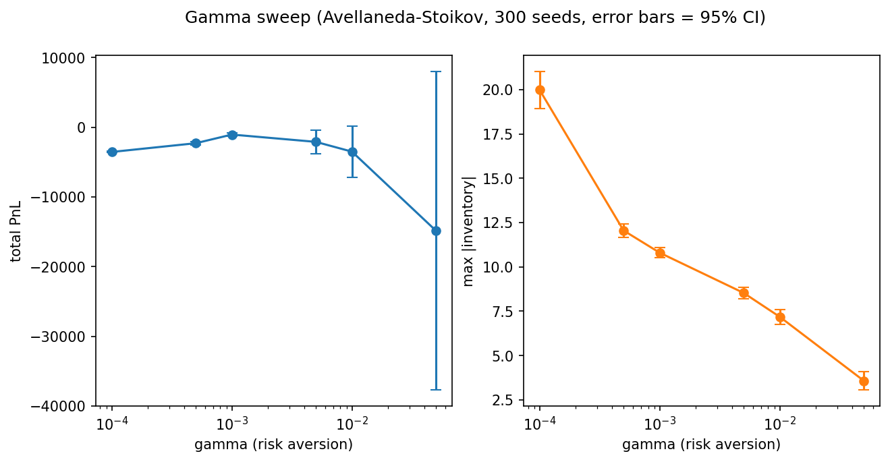

# Order Matching Engine

A low-latency limit order book matching engine in C++, wrapped in an
event-driven simulator, built to run market-making strategies against
(naive, inventory-capped, Avellaneda-Stoikov, order-flow-imbalance).

All planned work (M0–M6) is done: correct matching engine, memory pool +
benchmark suite, event-driven simulator with a queue-position fill model,
four market-making strategies with a full metrics suite, and Python
bindings for analysis. `RESULTS.md` has the short version of what got
built and what the study found, including three real bugs that only
showed up once the strategies were driven with continuous order flow.

## Quickstart

```bash
git clone <this repo> && cd order-matching-engine
./scripts/demo.sh
```

Configures, builds, runs the full test suite, smoke-checks the
benchmarks, and regenerates the plots below — under 10 minutes on a
clean checkout. If the last step can't find `lob_bindings`, see the
multi-Python note further down; the script prints the fix.

## Build & test

```bash
cmake -S . -B build -DCMAKE_BUILD_TYPE=RelWithDebInfo
cmake --build build -j
ctest --test-dir build --output-on-failure
```

Sanitized build (ASan + UBSan):

```bash
cmake -S . -B build -DLOB_ENABLE_SANITIZERS=ON -DCMAKE_BUILD_TYPE=Debug
cmake --build build -j
ctest --test-dir build --output-on-failure
```

Fuzzing the matching engine (needs real LLVM clang — AppleClang doesn't
ship libFuzzer):

```bash
cmake -S . -B build-fuzz \
  -DCMAKE_CXX_COMPILER=/opt/homebrew/opt/llvm/bin/clang++ \
  -DCMAKE_C_COMPILER=/opt/homebrew/opt/llvm/bin/clang
cmake --build build-fuzz -j
./build-fuzz/tests/lob_fuzz_matching -max_total_time=60
```

ThreadSanitizer for the SPSC ring buffer (separate binary — TSan and
ASan can't share a build):

```bash
cmake -S . -B build-tsan -DLOB_BUILD_TSAN_TESTS=ON -DLOB_BUILD_BENCHMARKS=OFF -DLOB_BUILD_FUZZERS=OFF
cmake --build build-tsan --target lob_tsan_tests -j
ctest --test-dir build-tsan --output-on-failure -R SpscRingBufferTest
```

## Architecture


```mermaid
graph BT
    L1["<b>L1 — Matching engine</b><br/>src/, include/lob/*.hpp<br/>Order, Level, OrderBook, MatchingEngine, OrderPool"]
    L2["<b>L2 — Strategy interface</b><br/>include/lob/sim/strategy.hpp<br/>Strategy, OrderIntentSink, BookSnapshot"]
    L3["<b>L3 — Simulator</b><br/>sim/<br/>Simulator, VirtualClock, SyntheticGenerator, MarketDataLog"]
    L4cpp["<b>L4 — Market-making (C++)</b><br/>mm/<br/>MarketMaker, Naive/InventoryCapped/AS/OFI, Metrics, SimulationRunner"]
    Bindings["<b>bindings/</b><br/>pybind11 (thin wrapper, no logic)"]
    L4py["<b>L4 — Analytics (Python)</b><br/>analysis/<br/>sweeps, plots, findings"]

    L2 --> L1
    L3 --> L1
    L3 --> L2
    L4cpp --> L2
    L4cpp --> L3
    Bindings --> L4cpp
    L4py --> Bindings

    style L1 fill:#ffddaa,stroke:#333,stroke-width:2px
```

Four layers, each testable on its own. L1 doesn't depend on anything
above it — the engine has no idea what a "strategy" is, and a strategy
has no idea how the book is stored. `Simulator` owns the one
`MatchingEngine` that both replayed and strategy orders match against.
Python only ever reaches down to a single `RunSimulation` entry point.

## Performance

```bash
cmake -S . -B build -DCMAKE_BUILD_TYPE=Release && cmake --build build -j
./build/benchmarks/lob_bench
```

Build without `-DLOB_ENABLE_SANITIZERS=ON` for real numbers — ASan/UBSan
instrumentation skews everything. Each number below is a p50 over
100,000 sampled operations on a warm book, from a shared dev laptop, not
an isolated benchmark rig (no thread pinning, no frequency-scaling
control).

| Operation | p50 | Throughput |
|---|---|---|
| Add (no cross) | 41ns | 16.5M/s |
| Add (5-level cross) | 292ns | 1.04M/s |
| Cancel | 41ns | 20.4M/s |
| Modify | 42ns | 12.8M/s |

The order-object memory pool (M3) cut Modify from 83ns to 42ns and the
5-level-cross case from 375ns to 292ns — everything else was already at
this platform's clock-resolution floor. A flat-array price-level index
benchmarked 25-33% faster than the `std::map` in production, but wasn't
adopted: no re-centering policy for prices drifting outside a fixed
window, and no profiling evidence yet that the tree is an actual
bottleneck for a single-threaded engine with no live feed.

## Market-making study

Four strategies, each adding one mechanic on top of the last:

1. **Naive** — fixed spread around mid, ignores inventory. The baseline.
2. **Inventory-capped** — same, but stops quoting a side past a cap.
3. **Avellaneda-Stoikov** — skews its quote price away from inventory,
   widens spread with time-to-horizon and market liquidity.
4. **OFI** — adds an order-flow-imbalance skew on top of AS.

Every number below is a mean over 300 seeded runs, ± 95% CI — not a
single lucky (or unlucky) run.

**All four lose money except inventory-capped.** That's not a bug either
— I checked. AS/OFI's `sigma` (their assumed volatility) was a placeholder
default that had never actually been checked against this book's real
volatility, so I ran a grid search over gamma/sigma/kappa (150+
combinations) to see if better calibration would fix it. It helped —
AS's loss dropped from -1058 to -655, OFI's from -945 to -539 — but
every configuration that trades a meaningful amount still loses money.
The ones that "break even" just stop trading almost entirely. That's a
real answer, not a bug: this synthetic order flow has no informational
edge for a market maker to capture — no informed/uninformed split, no
toxicity signal, just symmetric noise — so spread capture alone can't
beat adverse selection here, at any calibration. The numbers below
reflect the corrected calibration; the search itself is in `RESULTS.md`.




What the data says:

- **Naive is a coin flip, not a strategy.** Mean PnL is negative with a
  CI wider than the mean itself. Its inventory isn't just unbounded —
  the worst seed found so far is 4508 units, and every time the seed
  count went up, the worst case got worse, not better.
- **Inventory-capped, AS, and OFI all keep inventory in a tight band**
  (roughly ±9-55 units, consistently). The reservation-price skew (and
  the cap) actually does its job, even though it doesn't add up to
  positive PnL.
- **OFI's adverse-selection edge over plain AS doesn't show up.** The
  difference is -0.18 ± 2.37 per fill — not distinguishable from zero.
  Might be real and too small to see here at these fill counts, might
  not be real at all.
- **Higher latency loses less money**, roughly monotonically, because
  the strategy just trades less into adverse selection. Converges toward
  breakeven, not into profit.



**The gamma sweep also found a real bug**, separate from the calibration
question above. Push gamma too far past its sweet spot (here, ~0.008)
and one seed out of 300 loses **$2.1M** from 13 fills — same specific
seed both before and after the sigma fix, just less catastrophic once
sigma was corrected ($3.46M → $2.1M). Traced it: at high enough gamma,
the reservation-price skew from a handful of inventory units pushes the
quote thousands of ticks from the real mid. Liquidity is thin enough at
that gamma that there's often no real opposing quote for the
market-crossing clamp to check against, so the bad quote fills, becomes
the new reference price, and the next quote compounds on it. This is a
real property of the AS quoting formula under thin liquidity, not
something the calibration fix was ever going to remove. Full trace in
`RESULTS.md`.

### Three bugs found by just running it

The strategies looked correct against a couple of static test orders.
Wiring them up to continuous order flow found three real hangs:

1. **Cross-side race** — bid and ask acked independently, so one side
   could quote off a stale snapshot and cross the other side's own
   order once a late ack landed. Fix: only one Submit/Modify in flight
   across both sides at a time.
2. **Self-referential mid** — when a strategy's own order is the entire
   book at the best price, "mid" has no external anchor and drifts.
   Fix: only trust mid when at least one side isn't entirely the
   strategy's own order.
3. **Limit cycles** — AS/OFI's skew can cross the real market after a
   fill or two; rejecting and recomputing the same quote forever hangs.
   Fix: clamp against the real market, plus a circuit breaker on
   consecutive requotes.

All three reproduced as a killed, 100%-CPU process before the fix.
Full writeup: `include/lob/mm/market_maker.hpp`'s class comment.

### Python bindings

```bash
cmake --build build --target lob_bindings -j
pip install -r analysis/requirements.txt
python3 analysis/generate_plots.py
```

If `import lob_bindings` fails after building, you likely have more than
one Python on your machine and CMake picked a different one than your
shell. Check `grep Python3_EXECUTABLE build/CMakeCache.txt` against
`which python3`, and reconfigure with `-DPython3_EXECUTABLE=$(which
python3)` if they differ.

## Real-data validation (LOBSTER)

The simulator runs on synthetic order flow by default — real L3 data
needs registering with a vendor, so it's not something CI can fetch.
Tried it anyway against a real day of AAPL data from LOBSTER, replaying
it through the actual matching engine and diffing the result against
LOBSTER's own published order book, row by row.

Exact match: 0.027%. That's not an engine bug — LOBSTER's book already
has a full 5-level depth on both sides in row 0, built from pre-market
activity that has no record anywhere in the file, so there's no way to
reconstruct it from scratch. Restricting the comparison to price levels
both sides agree exist gets a better number: 73.2% of the time, the
engine's known resting size matches or is smaller than the real size (as
it should be — the engine can only under-know, never over-know, what's
resting at a shared price). Full mechanism trace, including a specific
order followed through the raw file, is in `RESULTS.md`.

## Testing

- `tests/order_book_test.cpp`, `matching_engine_test.cpp` — invariants,
  full/partial fills, cancel/modify, IOC/FOK/PostOnly.
- `tests/fuzz/fuzz_matching.cpp` — libFuzzer harness over the invariants.
- `tests/sim/golden_replay_test.cpp` — hand-computed checkpoints, not
  generated-and-snapshotted (which would only prove self-consistency).
- `tests/sim/simulator_determinism_test.cpp` — two runs, identical seed,
  byte-identical callback sequence and final book state.
- `tests/mm/*` — one file per strategy, plus the reconciliation base
  class and metrics suite.
